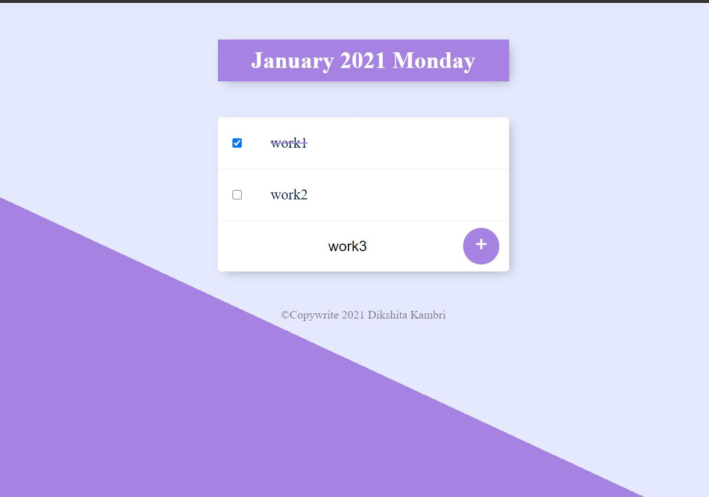
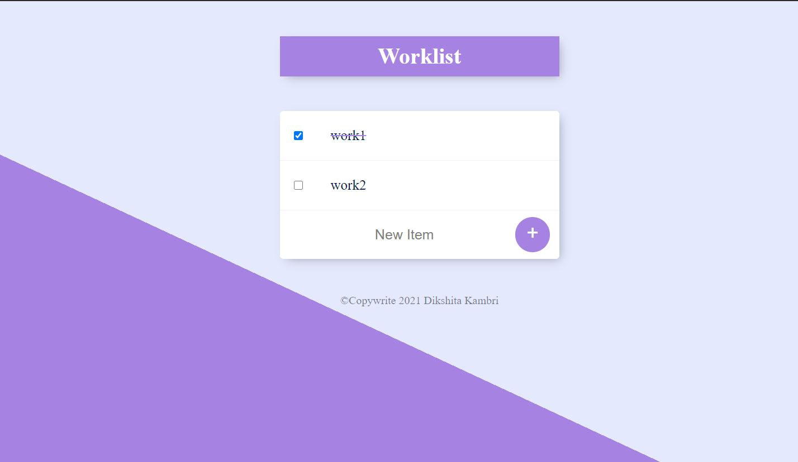

<h1>To-do list📋</h1>

In this To-do list, you can list out your daily work with corresponding date, mark as complete✔️. You can also create different worlist on work-route📝

<h4>Languages Used</h4>
<ul>
    <li>EJS-templating language</li>
    <li>CSS</li>
    <li>Javascript - Node.js</li>
</ul>

<h4>Framework Used</h4>
<ul>
    <li>Bootstrap(Frontend)</li>
    <li>Express.js(Backend)</li>
</ul>

 

    
Home-route

    
work-route

